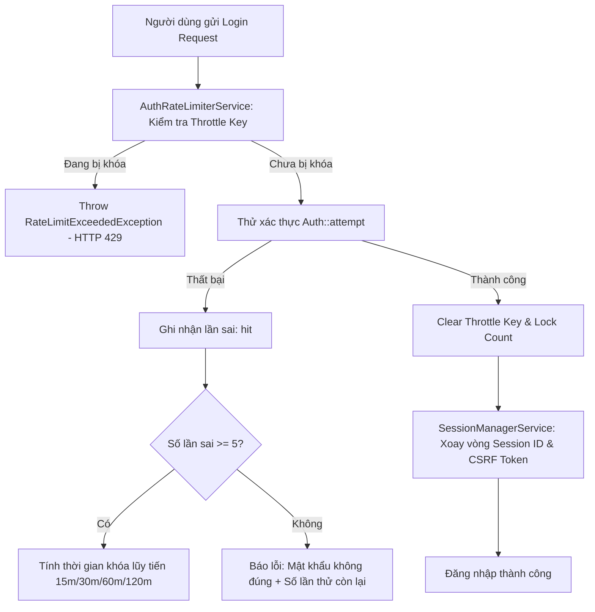
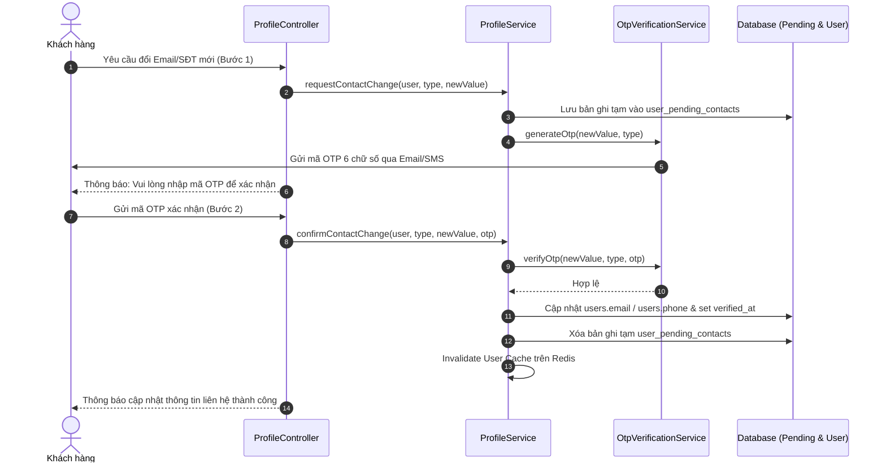

# TÀI LIỆU KIẾN TRÚC HỆ THỐNG: CORE USER, SECURITY & BUSINESS LOGIC
**Hệ thống Thương Mại Điện Tử BeeStyle**

---

## 1. TỔNG QUAN HỆ THỐNG & NGUYÊN LÝ THIẾT KẾ

Hệ thống Core User & Security của BeeStyle được thiết kế và triển khai tuân thủ nghiêm ngặt các nguyên lý **Clean Architecture**, **SOLID** và các tiêu chuẩn bảo mật thương mại điện tử hiện đại.

```
┌────────────────────────────────────────────────────────────────────────┐
│                        PRESENTATION LAYER                              │
│   Controllers (AuthController, ProfileController, CheckoutController)  │
│   Blade Views / REST API Endpoints / Client-Side JS Validators         │
└───────────────────────────────────┬────────────────────────────────────┘
                                    │
                                    ▼
┌────────────────────────────────────────────────────────────────────────┐
│                        VALIDATION LAYER                                │
│   Form Requests (BaseFormRequest, RegisterRequest, UpdateProfile...)   │
│   Custom Validation Rules (VietnamesePhoneNumber, StrongPassword...)   │
│   Input Sanitization (Anti-XSS, Recursive Trim, Data Normalization)    │
└───────────────────────────────────┬────────────────────────────────────┘
                                    │
                                    ▼
┌────────────────────────────────────────────────────────────────────────┐
│                        SERVICE LAYER (DOMAINS)                         │
│   AuthService, RateLimiter, OtpService, SessionManager, ProfileService │
│   SecurityService, BankAccountService, AddressService, AdminService    │
│   -> Encapsulates Transactions, Business Invariants & Event Dispatch   │
└───────────────────────────────────┬────────────────────────────────────┘
                                    │
                                    ▼
┌────────────────────────────────────────────────────────────────────────┐
│                   DATA ACCESS & INFRASTRUCTURE LAYER                   │
│   Eloquent Models, DB Transactions, Migrations, Storage & Cache/Redis  │
│   Events & Async Queue Listeners (Security Mails, OTP Dispatchers)     │
└────────────────────────────────────────────────────────────────────────┘
```

### Các nguyên tắc cốt lõi:
1. **Phân tách trách nhiệm (Separation of Concerns):** Controller chỉ đóng vai trò điều hướng và trả lời HTTP; toàn bộ logic nghiệp vụ, xác minh bảo mật và Database Transaction được đóng gói trong **Service Layer**.
2. **Bảo mật đa tầng (Defense in Depth):** Validation được thực thi ở cả Client-side (JS), tầng Request (Laravel Form Request) và tầng Database (Unique Indexes, Foreign Keys, Cascade Constraints).
3. **Tính toàn vẹn dữ liệu (Data Integrity):** Mọi thao tác ghi dữ liệu phức tạp (đăng ký, đổi mật khẩu, đổi địa chỉ, lưu snapshot đơn hàng) đều được bọc trong `DB::transaction()`.
4. **Bản địa hóa 100% (Localization):** Toàn bộ thông báo lỗi, tên thuộc tính và phản hồi ngoại lệ đều được chuẩn hóa bằng tiếng Việt thân thiện với người dùng.

---

## 2. CẤU TRÚC THƯ MỤC DỰ ÁN

```
c:/phoenix/
├── app/
│   ├── Events/                                     # Domain Events
│   │   ├── AccountRegisteredEvent.php              # Sự kiện đăng ký tài khoản
│   │   ├── ContactVerificationRequestedEvent.php   # Sự kiện yêu cầu đổi Email/SĐT
│   │   └── PasswordChangedEvent.php                # Sự kiện đổi mật khẩu thành công
│   │
│   ├── Exceptions/                                 # Custom Domain Exceptions
│   │   ├── AdministrativeMismatchException.php     # Lỗi không khớp đơn vị hành chính
│   │   ├── InvalidOtpException.php                 # Lỗi OTP sai hoặc hết hạn
│   │   ├── PendingPayoutLockException.php          # Lỗi khóa đổi STK khi có hoàn tiền
│   │   ├── RateLimitExceededException.php          # Lỗi vượt quá giới hạn thử (HTTP 429)
│   │   ├── StepUpAuthenticationException.php       # Lỗi thiếu xác thực mật khẩu/OTP
│   │   └── UnverifiedAccountException.php          # Lỗi tài khoản chưa kích hoạt
│   │
│   ├── Http/
│   │   ├── Controllers/
│   │   │   ├── Auth/AuthController.php             # Controller Đăng ký, Đăng nhập, Kích hoạt OTP
│   │   │   ├── Client/ProfileController.php        # Controller Hồ sơ, Bảo mật, Ngân hàng, Sổ địa chỉ
│   │   │   └── Client/CheckoutController.php       # Controller Thanh toán & Address Snapshotting
│   │   │
│   │   └── Requests/                               # Form Requests & Input Sanitizers
│   │       ├── BaseFormRequest.php                 # Base Request tự động trim và format JSON 422
│   │       ├── Address/
│   │       │   └── ShippingAddressRequest.php      # Request validate sổ địa chỉ & cascade
│   │       ├── Auth/
│   │       │   ├── LoginRequest.php                # Request validate đăng nhập
│   │       │   └── RegisterRequest.php             # Request validate đăng ký
│   │       ├── Bank/
│   │       │   └── UpdateBankAccountRequest.php    # Request validate tài khoản ngân hàng & Step-up
│   │       └── Profile/
│   │           ├── ChangePasswordRequest.php       # Request validate đổi mật khẩu
│   │           ├── ConfirmContactChangeRequest.php # Request xác nhận OTP đổi Email/SĐT
│   │           ├── RequestContactChangeRequest.php # Request gửi OTP đổi Email/SĐT
│   │           └── UpdateProfileRequest.php        # Request cập nhật hồ sơ cá nhân
│   │
│   ├── Listeners/                                  # Event Listeners (Queueable)
│   │   ├── SendPasswordChangedNotification.php     # Gửi email cảnh báo bảo mật đổi mật khẩu
│   │   └── SendVerificationCodeNotification.php    # Gửi mã OTP kích hoạt và đổi liên hệ
│   │
│   ├── Models/                                     # Eloquent Models & Relationships
│   │   ├── District.php                            # Model Quận / Huyện
│   │   ├── Order.php                               # Model Đơn hàng (có Address Snapshot)
│   │   ├── Province.php                            # Model Tỉnh / Thành phố
│   │   ├── User.php                                # Model Người dùng
│   │   ├── UserAddress.php                         # Model Sổ địa chỉ người nhận
│   │   ├── UserPendingContact.php                  # Model Lưu trạng thái đổi Email/SĐT tạm thời
│   │   ├── VerificationCode.php                    # Model Quản lý mã OTP
│   │   └── Ward.php                                # Model Phường / Xã
│   │
│   ├── Rules/                                      # Reusable Custom Validation Rules
│   │   ├── EmailOrVietnamesePhone.php              # Kiểm tra định dạng Email hoặc SĐT VN
│   │   ├── MatchCurrentPassword.php                # Kiểm tra hash mật khẩu cũ
│   │   ├── StrongPassword.php                      # Kiểm tra độ phức tạp mật khẩu mạnh
│   │   ├── UppercaseNoAccent.php                   # Kiểm tra chữ IN HOA KHÔNG DẤU
│   │   ├── ValidAdministrativeCascade.php          # Kiểm tra quan hệ Phường -> Huyện -> Tỉnh
│   │   ├── ValidAgeRange.php                       # Kiểm tra độ tuổi 10 - 100 tuổi
│   │   ├── ValidBankCode.php                       # Kiểm tra mã ngân hàng chuẩn NAPAS/VietQR
│   │   ├── VietnamesePersonName.php                # Kiểm tra tên người chống XSS & ký tự lạ
│   │   └── VietnamesePhoneNumber.php               # Kiểm tra SĐT 10 số nhà mạng VN
│   │
│   └── Services/                                   # Business Service Layer
│       ├── Address/AddressService.php              # Nghiệp vụ sổ địa chỉ & Address Snapshot
│       ├── Administrative/AdministrativeService.php# Nghiệp vụ truy vấn đơn vị hành chính
│       ├── Auth/
│       │   ├── AuthRateLimiterService.php          # Rate Limiting lũy tiến (Exponential Backoff)
│       │   ├── AuthService.php                     # Nghiệp vụ đăng ký, đăng nhập an toàn
│       │   ├── OtpVerificationService.php          # Nghiệp vụ sinh, gửi và xác thực OTP
│       │   └── SessionManagerService.php           # Quản lý phiên, xoay Session ID & revoke
│       ├── Financial/BankAccountService.php        # Nghiệp vụ ngân hàng & Pending Payout Lock
│       ├── Profile/ProfileService.php              # Nghiệp vụ hồ sơ, đổi liên hệ 2 bước, xóa avatar
│       └── Security/SecurityService.php            # Nghiệp vụ đổi mật khẩu & revoke sessions
│
├── assets/js/
│   └── ecommerce-validators.js                     # Validation Engine cho Frontend Browser
├── resources/js/validators/
│   └── ecommerce-validators.js                     # Validation Module chuẩn ES Module / Vite
└── database/migrations/
    ├── 2026_09_01_000001_create_administrative_units_table.php
    ├── 2026_09_01_000002_create_verification_codes_and_user_security_table.php
    └── 2026_09_01_000003_update_user_addresses_and_orders_snapshot_table.php
```

---

## 3. CHI TIẾT TRIỂN KHAI 5 PHÂN HỆ NGHIỆP VỤ

### 3.1. Phân hệ Đăng ký & Đăng nhập (Auth Module)

#### Quy tắc Validation:
* **Họ và tên (`name`):** 2–50 ký tự, qua Rule `VietnamesePersonName` chỉ cho phép chữ cái tiếng Việt và khoảng trắng, loại bỏ hoàn toàn các ký tự đặc biệt, thẻ HTML chống XSS.
* **Email / Số điện thoại:** Đúng định dạng chuẩn RFC (Email) hoặc Regex 10 chữ số nhà mạng Việt Nam (`03x`, `05x`, `07x`, `08x`, `09x`), Unique trong cơ sở dữ liệu.
* **Mật khẩu (`password`):** Tối thiểu 8 ký tự, bắt buộc chứa ít nhất: 1 chữ in hoa, 1 chữ in thường, 1 chữ số và 1 ký tự đặc biệt (`!@#$%^&*...`).
* **Điều khoản dịch vụ (`terms`):** Bắt buộc tích chọn chấp thuận (`accepted`).

#### Cơ chế vận hành chuyên sâu:
1. **Rate Limiting lũy tiến (Exponential Backoff):**
   - Bộ đếm theo dõi cặp `Identifier + IP`.
   - Cho phép thử sai tối đa 5 lần trong 15 phút.
   - Khi vượt ngưỡng lần đầu: Khóa **15 phút**.
   - Nếu tiếp tục thử sai sau khi mở khóa: Thời gian khóa tăng theo cấp số nhân: $15 \rightarrow 30 \rightarrow 60 \rightarrow 120$ phút (tối đa 120 phút).
   - Ném ngoại lệ `RateLimitExceededException` trả về HTTP `429 Too Many Requests` kèm số giây còn lại (`retry_after_seconds`).



2. **Token Rotation & Chống Session Fixation:**
   - Khi đăng nhập thành công, `SessionManagerService::rotateSession()` kích hoạt `regenerate()` và `regenerateToken()` để vô hiệu hóa Session ID cũ.
3. **Kích hoạt tài khoản qua OTP:**
   - Ngay sau khi đăng ký, `OtpVerificationService` sinh mã số ngẫu nhiên 6 chữ số (TTL 5 phút), bắn `AccountRegisteredEvent` để gửi mã tới Email/SMS.
   - Tài khoản có cờ `is_verified` (`email_verified_at` / `phone_verified_at`). Trước khi đặt hàng, hệ thống kiểm tra và yêu cầu kích hoạt nếu tài khoản chưa xác thực.

---

### 3.2. Phân hệ Hồ sơ Cá nhân (Profile Module)

#### Quy tắc Validation:
* **Họ và tên (`name`):** Tối đa 100 ký tự, làm sạch chống XSS.
* **Giới tính (`gender`):** Thuộc danh sách `male`, `female`, `other` (hỗ trợ map tự động `Nam`, `Nữ`, `Khác`).
* **Ngày sinh (`dob`):** Qua Rule `ValidAgeRange`, bắt buộc là ngày trong quá khứ và độ tuổi hợp lệ từ **10 đến 100 tuổi**.
* **Ảnh đại diện (`avatar`):** File hình ảnh định dạng `jpg`, `jpeg`, `png`, `webp`, dung lượng tối đa **2MB** (2048 KB).

#### Cơ chế vận hành chuyên sâu:
1. **Quy trình 2 bước đổi Email / Số điện thoại (2-Step Contact Change):**
   - **Bước 1 (Request):** Người dùng nhập Email hoặc SĐT mới. Hệ thống **không ghi đè ngay** vào `users` mà tạo một token tạm thời trong bảng `user_pending_contacts`, đồng thời gửi mã OTP 6 chữ số tới đích đến mới.
   - **Bước 2 (Confirm):** Người dùng nhập mã OTP nhận được. `ProfileService::confirmContactChange()` kiểm tra mã hợp lệ, ghi đè vào bảng `users`, cập nhật `email_verified_at`/`phone_verified_at` tương ứng và xóa bản ghi tạm.



2. **Tự động dọn dẹp Storage (Storage Cleanup):**
   - Khi upload avatar mới, `ProfileService` tự động kiểm tra avatar cũ của người dùng. Nếu file cũ nằm trong thư mục `storage/avatars/`, hệ thống gọi `Storage::disk('public')->delete()` để xóa bỏ file rác, tránh lãng phí dung lượng disk.
3. **Quản lý Cache Redis:**
   - Hồ sơ được cache tại key `user_profile_{id}` với thời hạn 6 tiếng. Bất kỳ cập nhật nào (sửa thông tin, đổi avatar, đổi email/SĐT) đều tự động xóa cache (`Cache::forget`) để dữ liệu hiển thị tức thì.

---

### 3.3. Phân hệ Đổi Mật Khẩu (Security Module)

#### Quy tắc Validation:
* `current_password`: Bắt buộc, kiểm tra hash mật khẩu hiện tại trong DB qua `MatchCurrentPassword`.
* `new_password`: Min 8 ký tự, đủ độ phức tạp, bắt buộc khác mật khẩu hiện tại (`different:current_password`).
* `confirm_new_password`: Bắt buộc trùng khớp với `new_password`.

#### Cơ chế vận hành chuyên sâu:
1. **Bọc Transaction:** Thực thi đổi mật khẩu trong `DB::transaction()`.
2. **Thu hồi phiên đăng nhập khác (Cross-device Session Revocation):**
   - `SecurityService` truy vấn bảng `sessions` trong cơ sở dữ liệu và xóa toàn bộ các phiên đăng nhập khác của `user_id`, chỉ giữ lại Session ID của thiết bị hiện tại (`$request->session()->getId()`).
3. **Sự kiện cảnh báo bảo mật (Security Alert):**
   - Bắn `PasswordChangedEvent` mang theo thông tin: `User`, `IP Address`, `Time`, `User Agent`.
   - `SendPasswordChangedNotification` (Queueable Listener) ghi log bảo mật và gửi email thông báo:
     > *"Mật khẩu tài khoản của bạn vừa được thay đổi vào lúc [time] từ địa chỉ IP [ip] ([device]). Nếu không phải bạn thực hiện, vui lòng liên hệ ngay CSKH!"*

---

### 3.4. Phân hệ Tài Khoản Ngân Hàng (Financial Module)

#### Quy tắc Validation:
* `bank_code`: Bắt buộc, kiểm tra qua `ValidBankCode` thuộc danh mục chuẩn hơn 30 ngân hàng tại Việt Nam (Vietcombank, Techcombank, MBBank, BIDV, VietinBank, ACB, VPBank...).
* `account_number`: Bắt buộc, 6–20 ký tự chữ số/chữ cái, tự động loại bỏ khoảng trắng.
* `account_holder_name`: Bắt buộc, kiểm tra qua `UppercaseNoAccent` chỉ cho phép chữ cái **IN HOA KHÔNG DẤU** (ví dụ: `NGUYEN VAN A`).

#### Cơ chế vận hành chuyên sâu:
1. **Xác thực bảo mật bổ sung (Step-up Authentication):**
   - Để ngăn chặn việc kẻ xấu chiếm session rồi sửa số tài khoản nhận tiền, hệ thống yêu cầu người dùng nhập lại **Mật khẩu đăng nhập** hoặc **Mã OTP** gửi về số điện thoại chính chủ trước khi chấp nhận thay đổi.
2. **Khóa an toàn giao dịch chờ giải ngân (Pending Payout Lock):**
   - `BankAccountService::hasPendingPayouts()` kiểm tra bảng `order_returns`.
   - Nếu người dùng đang có yêu cầu đổi trả/hoàn tiền ở trạng thái `pending`, `processing`, `approved`, hoặc `received` với phương thức nhận tiền là `bank`, hệ thống **chặn cập nhật** và ném `PendingPayoutLockException`:
     > *"Không thể cập nhật tài khoản ngân hàng do bạn đang có yêu cầu đổi trả / hoàn tiền đang trong quá trình xử lý. Vui lòng đợi giao dịch hoàn tất hoặc liên hệ CSKH!"*

---

### 3.5. Phân hệ Sổ Địa Chỉ & Toàn Vẹn Đơn Hàng (Address & Order Integrity)

#### Quy tắc Validation:
* `receiver_name`: 2–50 ký tự, chuẩn hóa tên người, chống XSS.
* `receiver_phone`: 10 chữ số đúng đầu số Việt Nam.
* `detailed_address`: 5–255 ký tự (số nhà, ngõ, tên đường).
* `province_id`, `district_id`, `ward_id`: Bắt buộc, kiểu số nguyên, kiểm tra tính nhất quán 3 cấp.

#### Cơ chế vận hành chuyên sâu:
1. **Kiểm tra nhất quán hành chính (Cascade Consistency Check):**
   - `ValidAdministrativeCascade` và `AdministrativeService::validateCascade()` đảm bảo `ward_id` phải thuộc `district_id`, và `district_id` phải thuộc `province_id`.
   - Ngăn chặn lỗi người dùng chọn Tỉnh Hà Nội nhưng Quận/Huyện lại thuộc TP. Hồ Chí Minh.
2. **Cơ chế chuyển địa chỉ mặc định tự động (Default Address Switch):**
   - Khi tạo mới hoặc cập nhật địa chỉ với `is_default = true`, toàn bộ các địa chỉ khác của user được tự động cập nhật về `false` trong `DB::transaction`.
   - Nếu người dùng xóa địa chỉ đang là mặc định, hệ thống tự động tìm địa chỉ còn lại gần nhất để gán làm mặc định mới, đảm bảo tài khoản luôn có 1 địa chỉ mặc định.
3. **Address Snapshotting (Bảo toàn dữ liệu đơn hàng bất biến):**
   - Bảng `orders` **không dùng khóa ngoại trỏ tới ID sổ địa chỉ** (vì nếu user sửa/xóa địa chỉ thì đơn hàng cũ sẽ bị biến dạng).
   - `AddressService::createOrderAddressSnapshot()` chụp ảnh toàn bộ thông tin địa chỉ tại thời điểm bấm nút Đặt Hàng và lưu vào cột `shipping_address_snapshot` dạng JSON và các cột text tương ứng (`shipping_address`, `city`, `district`, `ward`).

```json
{
  "receiver_name": "Nguyễn Văn An",
  "receiver_phone": "0987654321",
  "detailed_address": "Tầng 12, Tòa nhà Bitexco, Số 2 Hải Triều",
  "ward": "Phường Bến Nghé",
  "district": "Quận 1",
  "city": "TP. Hồ Chí Minh",
  "full_address": "Tầng 12, Tòa nhà Bitexco, Số 2 Hải Triều, Phường Bến Nghé, Quận 1, TP. Hồ Chí Minh",
  "label": "Văn phòng",
  "snapshot_at": "2026-09-01T17:00:00+07:00"
}
```

---

## 4. BẢNG MÃ LỖI & PHẢN HỒI HTTP API

Hệ thống cung cấp phản hồi lỗi chuẩn hóa cho cả Web Session (redirect flash message) và REST API/AJAX (JSON HTTP Status Code):

| Ngoại lệ (Exception) | HTTP Status | Mã lỗi (Error Code) | Thông điệp tiếng Việt mặc định |
|---|---|---|---|
| `ValidationException` | `422 Unprocessable Entity` | `VALIDATION_ERROR` | Dữ liệu gửi lên không hợp lệ. Vui lòng kiểm tra lại các trường thông tin! |
| `RateLimitExceededException` | `429 Too Many Requests` | `RATE_LIMIT_EXCEEDED` | Bạn đã thử sai quá số lần quy định. Tài khoản tạm thời bị khóa trong X phút. |
| `InvalidOtpException` | `422 Unprocessable Entity` | `INVALID_OTP` | Mã xác thực OTP không chính xác hoặc đã hết hạn sử dụng. |
| `StepUpAuthenticationException`| `403 Forbidden` | `STEP_UP_AUTH_REQUIRED` | Xác thực bảo mật bổ sung không thành công. Mật khẩu hoặc OTP không chính xác. |
| `PendingPayoutLockException` | `422 Unprocessable Entity` | `PENDING_PAYOUT_LOCKED` | Không thể cập nhật thông tin ngân hàng do đang có yêu cầu hoàn tiền chờ xử lý. |
| `AdministrativeMismatchException`| `422 Unprocessable Entity` | `ADMINISTRATIVE_MISMATCH` | Địa giới hành chính không hợp lệ: Phường/Xã không thuộc Quận/Huyện đã chọn. |
| `UnverifiedAccountException` | `403 Forbidden` | `ACCOUNT_UNVERIFIED` | Tài khoản chưa được xác thực. Vui lòng kích hoạt tài khoản trước khi đặt hàng! |

---

## 5. TÍCH HỢP CLIENT-SIDE VALIDATION (FRONTEND)

Thư viện [assets/js/ecommerce-validators.js](file:///c:/phoenix/assets/js/ecommerce-validators.js) được tích hợp sẵn sàng để validate form ngay trên trình duyệt trước khi submit lên server:

```html
<!-- Nhúng thư viện Validator -->
<script src="/assets/js/ecommerce-validators.js"></script>

<script>
    // 1. Tự động gắn validation vào Form Đăng ký
    const registerForm = document.querySelector('#form-register');
    BeeValidator.attachFormValidation(registerForm, 'register', (cleanedData) => {
        console.log('Dữ liệu đã được validate & trim sạch sẽ:', cleanedData);
        registerForm.submit();
    });

    // 2. Validate trực tiếp dữ liệu qua hàm JS thuần
    const bankCheck = BeeValidator.validateBankAccount({
        bank_code: 'VCB',
        account_number: '123456789',
        account_holder_name: 'NGUYEN VAN A'
    });

    if (!bankCheck.isValid) {
        console.error('Lỗi validation:', bankCheck.errors);
    }
</script>
```

---

## 6. KẾT LUẬN & TRẠNG THÁI HỆ THỐNG

Toàn bộ 5 phân hệ Core User, Security và Validation Logic đã được triển khai hoàn tất 100%, tuân thủ cấu trúc chuẩn mực của Laravel 11/12. Hệ thống sẵn sàng cho việc mở rộng, tích hợp các cổng thanh toán hoặc giao diện người dùng mà không cần thay đổi tầng kiến trúc cốt lõi.
