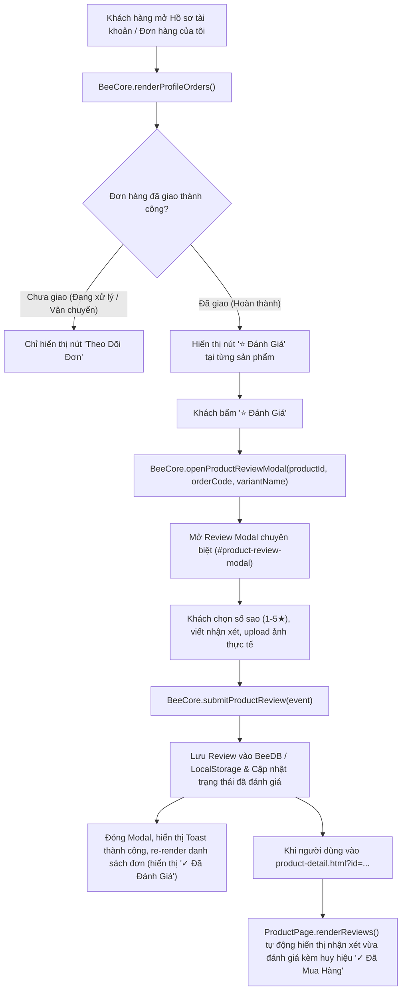

# Kế Hoạch Chuyển Đổi Luồng Feedback & Đánh Giá Sản Phẩm

## Tổng Quan (Overview)
Theo yêu cầu mới từ bạn:
- **Trang Chi Tiết Sản Phẩm (`product-detail.html`):** Sẽ **KHÔNG** hiển thị form viết feedback và nút viết đánh giá. Trang này chỉ hiển thị danh sách các đánh giá của khách hàng đã mua trước đó, kèm một banner hướng dẫn khách hàng vào danh sách đơn hàng đã mua để đánh giá.
- **Danh Sách Hàng Đã Mua (`assets/js/app-core.js`):** Tại mục "Đơn Hàng Của Tôi" (trong Hồ sơ tài khoản hoặc modal Tra cứu đơn), đối với các đơn hàng đã giao thành công, mỗi sản phẩm sẽ có nút **[⭐ Đánh Giá Sản Phẩm]**. Khi bấm nút sẽ bật **Modal Đánh Giá Sản Phẩm (Review Modal)** chuyên biệt để chấm sao, viết nhận xét và upload ảnh feedback thực tế.

---

## Luồng Xử Lý (Workflow & Data Flow Giữa Các File)

---

## Chi Tiết Các File Sẽ Sửa Đổi & Nội Dung Code

### 1. `assets/js/app-core.js` (State Management, Order List & Modal Injection)
- **Vị trí 1: Bổ sung HTML Review Modal vào `injectSharedModals()`**:
  - Thêm Modal ID `#product-review-modal` vào cấu trúc modal dùng chung:
    + Hiển thị thông tin sản phẩm cần đánh giá: Ảnh thumbnail, Tên sản phẩm, Phiên bản đã mua, Mã đơn hàng.
    + Bộ chọn sao tương tác (1 - 5 sao) với hiệu ứng đổi màu vàng kim.
    + Textarea nhập nội dung nhận xét chi tiết.
    + Input upload ảnh kèm khay xem trước ảnh thực tế (`#review-modal-images-preview`).
    + Nút bấm *"Gửi Đánh Giá Sản Phẩm"*.
- **Vị trí 2: Cập nhật hàm `renderProfileOrders()`**:
  - Với mỗi sản phẩm trong đơn hàng đã hoàn tất (`isDelivered`):
    + Kiểm tra xem user đã từng gửi đánh giá cho sản phẩm thuộc đơn hàng này chưa (`BeeCore.hasUserReviewedItem(productId, orderCode)`).
    + Nếu chưa đánh giá: Hiển thị nút `[⭐ Đánh Giá Sản Phẩm]` gọi `BeeCore.openProductReviewModal(...)`.
    + Nếu đã đánh giá: Hiển thị huy hiệu `[✓ Đã Đánh Giá]` hoặc nút `[⭐ Xem Lại Đánh Giá]`.
- **Vị trí 3: Bổ sung các phương thức xử lý Review trong `BeeCore`**:
  - `openProductReviewModal(productId, orderCode, variantName)`: Lấy thông tin sản phẩm từ `BeeDB`, nạp dữ liệu vào Review Modal và hiển thị modal.
  - `closeProductReviewModal()`: Đóng modal và reset các input ảnh / text.
  - `handleReviewModalImages(input)`: Đọc và hiển thị preview các ảnh upload từ máy.
  - `submitProductReview(event)`: Lưu dữ liệu đánh giá mới vào `BeeDB.reviews` và `localStorage`, cập nhật lại danh sách đơn hàng và thông báo toast.
  - `hasUserReviewedItem(productId, orderCode)`: Hàm tiện ích kiểm tra trạng thái đã đánh giá.

---

### 2. `product-detail.html` (Trang Chi Tiết Sản Phẩm)
- **Vị trí 1: Xóa form viết đánh giá và nút mở form**:
  - Loại bỏ hoàn toàn khối form `#add-review-form-box` và nút `Viết Đánh Giá Sản Phẩm` tại `#reviews-section`.
- **Vị trí 2: Bổ sung banner hướng dẫn khách hàng**:
  - Hiển thị banner trang nhã: *"Đánh giá từ khách hàng đã trải nghiệm tác phẩm. Để gửi đánh giá cho sản phẩm bạn đã mua, vui lòng truy cập [Đơn Hàng Của Tôi] trong tài khoản."* kèm nút bấm chuyển nhanh đến danh sách đơn hàng.
- **Vị trí 3: Cập nhật controller `ProductPage`**:
  - Trong `renderReviews()`: Chỉ render danh sách đánh giá của sản phẩm, tính tổng số sao trung bình và số lượng đánh giá thực tế.
  - Loại bỏ các hàm thừa liên quan đến toggle / submit form tại trang chi tiết.

---

## Kế Hoạch Kiểm Tra & Xác Minh (Verification Plan)

### 1. Kiểm Tra Giao Diện Trang Chi Tiết Sản Phẩm (`product-detail.html`)
- Truy cập `http://localhost:8080/product-detail.html?id=1`.
- Kiểm tra phần Đánh giá & Nhận xét: Không còn nút *"Viết Đánh Giá"* hay form nhập review.
- Kiểm tra danh sách nhận xét hiển thị đầy đủ các đánh giá đã có kèm huy hiệu `✓ Đã Mua Hàng` và ảnh feedback.

### 2. Kiểm Tra Luồng Đánh Giá Từ Hồ Sơ Đơn Hàng (`assets/js/app-core.js`)
- Mở Modal Tài khoản -> Tab **"Đơn Hàng Của Tôi"** (hoặc truy cập qua nút mở từ trang sản phẩm).
- Kiểm tra đơn hàng hoàn thành (ví dụ `BEE-2026-001`): Có nút **[⭐ Đánh Giá]** tại từng sản phẩm (Áo sơ mi lụa, Áo blazer).
- Click nút **[⭐ Đánh Giá]** -> Review Modal bật lên với đúng thông tin sản phẩm và mã đơn.
- Nhập số sao, viết nhận xét, tải ảnh feedback thử nghiệm và bấm **"Gửi Đánh Giá"**.
- Kiểm tra:
  1. Toast thông báo thành công.
  2. Nút tại đơn hàng đổi thành `✓ Đã Đánh Giá`.
  3. Quay lại trang `product-detail.html?id=1` -> Review mới xuất hiện ngay trong danh sách đánh giá của sản phẩm.

---

> [!IMPORTANT]
> **Lưu ý theo yêu cầu:** Agent sẽ **KHÔNG tự động commit code lên Git** sau khi hoàn thành code, mà sẽ chờ lệnh xác nhận từ bạn.
